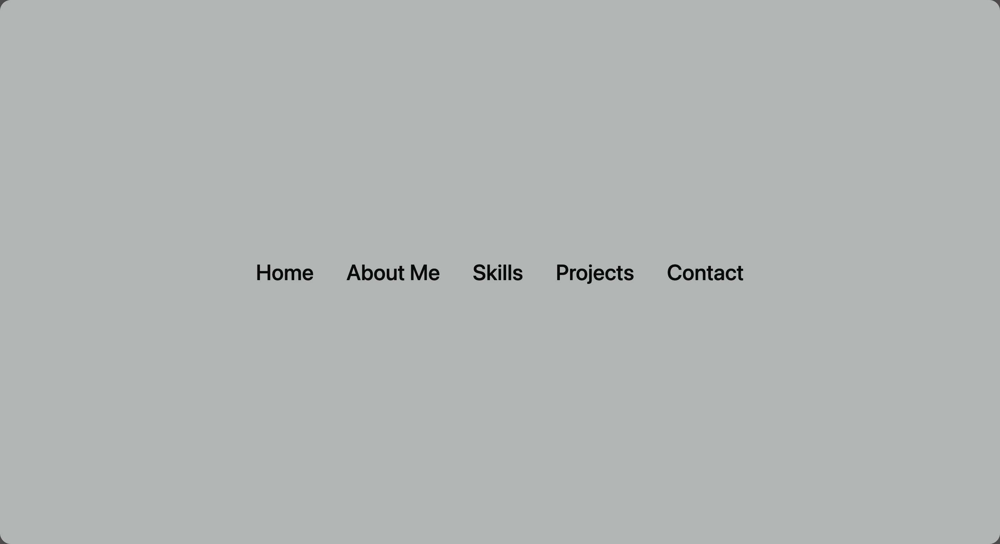

## 🚀 Animated Navigation Highlight
A modern interactive navigation hover effect built using HTML, SCSS, and the new CSS Anchor Positioning API. When you hover over any menu item, a smooth white highlight box automatically moves and resizes to match that item — creating a clean and futuristic navigation experience.

## 🌐 Live Demo
https://dev-hamza03.github.io/animated-nav-highlight/

## 📁 GitHub Repository
https://github.com/dev-hamza03/animated-nav-highlight

## ✨ Features
• Smooth hover-follow highlight  
• Powered by CSS Anchor Positioning API  
• Pure HTML + SCSS — no JavaScript required  
• Lightweight and responsive  
• Modern blend-mode highlight  
• Perfect for navbars, menus, dashboards, portfolios  

## 🖼️ Screenshot


## 🛠 Technologies Used
HTML5  
SCSS  
CSS Anchor Positioning API  
Mix-blend-mode  

## 📂 Project Structure
```
animated-nav-highlight  
├── index.html  
├── style.scss  
├── style.css  
└── assets  
    └── images/
```

## 🚀 Installation (Clone This Project)
git clone https://github.com/dev-hamza03/animated-nav-highlight  
Open index.html in your browser.

## 💡 How It Works
1. Each menu item becomes an anchor using `anchor-name`  
2. On hover, that item sets itself as the active anchor  
3. The `.anchor` highlight follows using:
   ```
   top: anchor(top);  
   left: anchor(left);  
   width: anchor(width);  
   height: anchor(height);
   ```
   
5. A CSS transition makes the movement smooth and elegant  

## 📜 Core CSS Example
```
.box:hover { anchor-name: --nav; }  
.anchor { position-anchor: --nav; top: anchor(top); left: anchor(left); width: anchor(width); height: anchor(height); }
```

## 🔧 Customization
• Change highlight color  
• Adjust transition speed  
• Add more nav items easily  
• Make horizontal or vertical menus  
• Add glowing effects  

## 🔮 Future Enhancements
• Mobile touch support  
• Active link highlight  
• Scroll-based active state  
• Multiple highlight styles  

## ⭐ Support
If you like this project, please ⭐ star the repository — your support motivates me to build more creative UI effects.

## 📜 License
This project is open-source and free to use.
